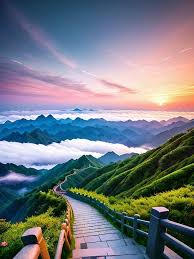

# Generative Adversarial Networks (GANs) Project

## Table of Contents

1. [Introduction](#introduction)
2. [Features](#features)
3. [Technologies Used](#technologies-used)
4. [Project Components](#project-components)
   - [DCGAN for MNIST](#dcgan-for-mnist)
   - [Pix2Pix for Satellite to Map Transformation](#pix2pix-for-satellite-to-map-transformation)
   - [Old Photo Restoration using GFP-GAN](#old-photo-restoration-using-gfp-gan)
   - [Image Inpainting with BoundLess](#image-inpainting-with-boundless)
5. [Demo](#demo)
6. [Contributing](#contributing)
7. [License](#license)
8. [Contact](#contact)

## Introduction

This project explores various applications of Generative Adversarial Networks (GANs) in the field of deep learning and computer vision. It showcases the versatility and power of GANs in tasks ranging from image generation to image-to-image translation and beyond.

## Features

- Generate handwritten digits using DCGAN
- Transform satellite images into map images using Pix2Pix
- Restore old photos using GFP-GAN
- Predict missing parts of images using BoundLess

## Technologies Used

- Python
- TensorFlow
- PyTorch
- Keras
- CUDA (for GPU acceleration)

## Project Components

### DCGAN for MNIST

Deep Convolutional GAN (DCGAN) is implemented to generate handwritten digits from random noise. This model is trained on the MNIST dataset, which contains 70,000 images of handwritten digits.

How it works:

1. The Generator network takes random noise as input and generates fake images.
2. The Discriminator network tries to distinguish between real MNIST images and the generated fake images.
3. Through adversarial training, the Generator learns to produce increasingly realistic handwritten digits.

This implementation follows the architecture described in the DCGAN paper, using convolutional and transposed convolutional layers.

&nbsp;
_Generated handwritten digits using DCGAN, showcasing diverse and clear digit forms._
&nbsp;
&nbsp;

&nbsp;
_Another set of DCGAN-generated digits, demonstrating the model's consistency in producing varied, realistic handwritten numbers._
&nbsp;
&nbsp;

<!--  -->
<!--  -->

### Pix2Pix for Satellite to Map Transformation

Pix2Pix is a conditional GAN model used here to transform satellite images into map images, similar to the style used in Google Maps.

How it works:

1. The model is trained on pairs of satellite images and their corresponding map representations.
2. The Generator learns to transform satellite images into map-style images.
3. The Discriminator learns to distinguish between real and generated map images.
4. The model uses a U-Net architecture for the generator and a PatchGAN for the discriminator.

This implementation allows for the automatic creation of map-style images from satellite imagery, which has applications in cartography and geospatial analysis.

<!-- 
&nbsp;
&nbsp;
&nbsp;

&nbsp;
&nbsp;
&nbsp;
 -->

&nbsp;
&nbsp;
&nbsp;

&nbsp;
&nbsp;
&nbsp;

&nbsp;
&nbsp;
&nbsp;

&nbsp;
_Pix2Pix transformation of satellite imagery to map-style images. Left: Input satellite image, Middle: Ground Truth, Right: Genrated Map._

&nbsp;
&nbsp;
.png>)
&nbsp;
_Epoch:- 1k_
&nbsp;
&nbsp;

<!--  -->

&nbsp;
_Epoch:- 39k_
&nbsp;
&nbsp;

<!--  -->

### Old Photo Restoration using GFP-GAN

This component implements the Generative Facial Prior GAN (GFP-GAN) architecture to restore old, damaged photos.

How it works:

1. The GFP-GAN uses a pre-trained face GAN as a prior to guide the restoration process.
2. It employs a U-Net architecture with spatial feature transform layers to incorporate the facial prior.
3. The model is trained on pairs of degraded and high-quality facial images.
4. During inference, it can restore old photos, improving their quality and clarity.

This implementation uses a pre-trained model from the official GFP-GAN GitHub repository.

&nbsp;
&nbsp;
&nbsp;

&nbsp;
&nbsp;
&nbsp;

&nbsp;
&nbsp;
&nbsp;

&nbsp;
&nbsp;
&nbsp;

&nbsp;
&nbsp;
&nbsp;

&nbsp;
&nbsp;
&nbsp;
_GFP-GAN restoration of an old portrait, dramatically improving clarity and detail._

### Image Inpainting with BoundLess

The BoundLess architecture is used to predict and fill in missing parts of images, a task known as image inpainting.

How it works:

1. The model takes an image with missing regions (masked areas) as input.
2. It uses a two-stage coarse-to-fine network architecture.
3. The coarse network generates a rough completion of the missing regions.
4. The refinement network then produces the final high-quality inpainted result.
5. The model is trained using a combination of reconstruction loss, perceptual loss, and adversarial loss.

This implementation allows for the realistic completion of images with missing or damaged portions.

<!--  -->
<!-- &nbsp;
&nbsp;
&nbsp; -->

&nbsp;
&nbsp;
&nbsp;

&nbsp;
&nbsp;
&nbsp;

&nbsp;
&nbsp;
&nbsp;
&nbsp;
&nbsp;
&nbsp;

_Figure 16: BoundLess image inpainting results. Left: Original image , Middle: Masked Image, Right: Genrated Image._

<!-- &nbsp;
&nbsp;
&nbsp;

&nbsp;
&nbsp;
&nbsp;

&nbsp;
&nbsp;
&nbsp;
 -->

## Contributing

Contributions are welcome! Please feel free to submit a Pull Request.
